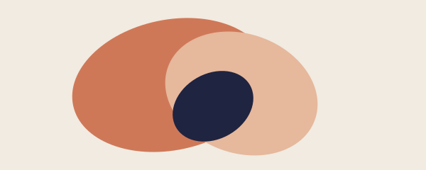

The whole point of this site is to make it easier to read things that keep
getting in the way of being read. A page that puts its content first, loads
fast, and stops trying to interrupt the reading itself.

## A short paragraph

Lorem ipsum is fine when you're sketching a layout, but a few real sentences
tell you more about the rhythm of a page than any placeholder. This is a
sentence that wants you to keep reading. The next one rewards that, briefly.



## Lists, blockquotes, code

Some things are easier as a list:

- Read what was written
- Without the chrome around it
- Or the asks above it

> Whoever made the page didn't write it, but they sure had opinions about
> which words you should see first.

```ts
function unblock(url: string) {
  return new URL(url).pathname;
}
```

There's more, but the bones are here.
